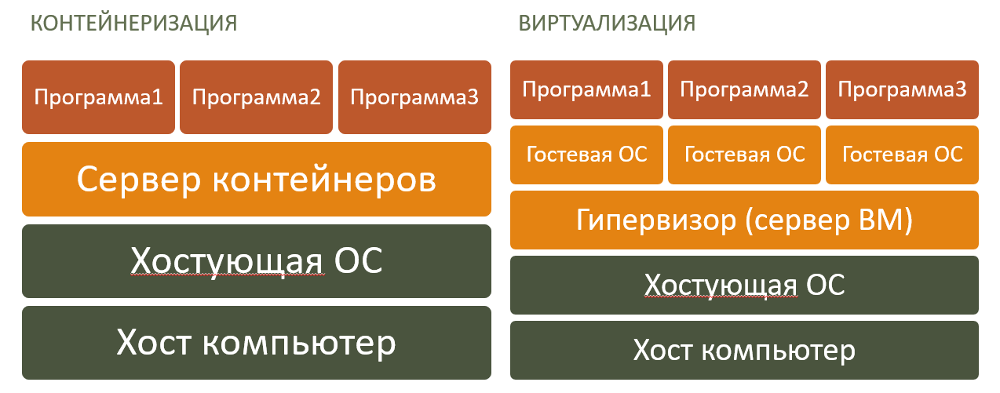

# Введение / История

- [Введение / История](#введение--история)
  - [Идея изоляции процессов](#идея-изоляции-процессов)
  - [Понятие контейнеризации](#понятие-контейнеризации)
  - [Область применения](#область-применения)
  - [Преимущества и недостатки](#преимущества-и-недостатки)
  - [История развития контейнеризации](#история-развития-контейнеризации)
  - [Библиография:](#библиография)

## Идея изоляции процессов

*Изоляция процессов* - это возможность запускать несколько процессов в рамках одной операционной системы, но с изолированными друг от друга ресурсами. Такие процессы не могут влиять друг на друга, их работа не зависит друг от друга. Изоляция процессов позволяет запускать несколько приложений на одном хосте, не беспокоясь о том, что одно приложение может повлиять на работу другого. Изоляция процессов позволяет запускать несколько приложений на одном хосте, не беспокоясь о том, что одно приложение может повлиять на работу другого. Изоляция процессов позволяет запускать несколько приложений на одном хосте, не беспокоясь о том, что одно приложение может повлиять на работу другого.

Целью изоляции процессов является безопасность и надёжность работы приложений. Если одно приложение завершается с ошибкой, то это не влияет на работу других приложений. Если одно приложение подвергается атаке, то это не влияет на работу других приложений.

## Понятие контейнеризации

Под *виртуализацией* понимают технологию, которая позволяет запускать экземпляр некоторой операционной системы в рамках другой операционной системы (называемой *хостом*). Для виртуализации гипервизор (программа виртуализации) реализует эмуляцию аппаратных средств (процессора, памяти, дискового пространства, сетевых интерфейсов и т.д.), то есть создаёт виртуальную машину, на которую устанавливается операционная система. Виртуализация позволяет запускать несколько экземпляров операционной системы на одном хосте. Каждый экземпляр имеет соответственно свои собственные процессы, файловую систему, сетевые интерфейсы и пользователей.

*Контейнеризация* это метод виртуализации, в котором используются ресурсы ядра операционной системы. Это отличие от обычной виртуализации, в которой происходит аппаратная эмуляция. Часто контейнеризация используется для создания изолированных экземпляров конкретных приложений, а не операционной системы целиком. Эти изолированные экземпляры приложений называются контейнерами.

Контейнеризация, в отличие от виртуализации, потребляет значительно меньше ресурсов, так как:

- не выполняет эмуляцию аппаратных средств, а предоставляет доступ к аппаратным средствам хоста.
- не создаёт гостевой операционной системы, которая потребляет дополнительные ресурсы;

## Область применения

Не смотря на то, что первоначальная идея контейнеризации касалась безопасности и надежности, сейчас контейнеры используются в основном для разработки, тестирования и развёртывания программных продуктов. Контейнеры позволяют создавать программные продукты, которые работают в любой операционной системе, не зависят от аппаратного обеспечения и не требуют установки дополнительных зависимостей.

Сфера применения контейнеров:

- *Разработка программных продуктов* – создание программных продуктов возможно под любую операционную систему;
- *Тестирование программных продуктов* - отладка программ в контейнерах безопаснее и проще;
- *Сборка программных продуктов* - сборка программ в контейнерах позволяет избежать проблем с зависимостями;
- *Развертывание информационных систем* - развёртывание кластера контейнеров сводится к созданию и запуску контейнеров на базе образов.

## Преимущества и недостатки

Успех технологии контейнеризации обеспечен её преимуществами, такими как:

- *Простота создания* – контейнеры легко создавать, запускать и удалять;
- *Гибкая среда* – создание, перезапуск и удаление контейнеров значительно быстрее работы с виртуальными машинами;
- *Малое потребление ресурсов* - в отличие от виртуализации, контейнеры используют общее ядро ОС, что позволяет запускать большое количество контейнеров на одном хосте;
- *Повышенная производительность* - в отличие от виртуализации, контейнеры используют общее ядро ОС, что позволяет запускать большое количество контейнеров на одном хосте;
- *Переносимость* – контейнер встраивает все зависимости;
- *Стандартизация* – основан на открытых стандартах;
- *Безопасность* – каждый контейнер изолирует свои процессы от другого и от хоста.

Однако есть и некоторые недостатки контейнеризации:

- *Ограниченные возможности* – контейнеры не могут работать с аппаратным обеспечением напрямую;
- *Повышенная сложность управления кластером контейнеров* – управление взаимодействием группы контейнеров – нетривиальная задача.

Данные недостатки преодолеваются с развитием технологии контейнеризации, а также с описанием рекомендаций по использованию контейнеров. Несмотря на эти недостатки, контейнеры являются одной из самых популярных технологий в области разработки и развёртывания программных продуктов.

## История развития контейнеризации

История развития контейнеризации включает в себя виртуализацию, изоляцию процессов и контейнеризацию.

Первые попытки виртуализации были предприняты в 1960-х годах.  Первые эксперименты в этом направлении проводили сотрудники исследовательского центра компании IBM, которые разрабатывали программные эмуляторы для компьютеров IBM 7040, позволявшие запускать несколько экземпляров приложения на одной машине. В 1966 году была создана первая виртуальная машина IBM VM/370. В перспективе такие эмуляторы должны были способствовать развитию аппаратно-независимых программ и облегчить переносимость кода на ЭВМ с другими архитектурами. Виртуализация требовалась и для совершенствования языков программирования высокого уровня: с ее помощью создавалась среда выполнения для пользовательских приложений, осуществлялась репликация операционной среды, эмулировалась система команд процессора.

Если появление виртуальных машин стало отправной точкой для развития систем контейнеризации, то поворотным моментом в их истории был, безусловно, 1979 год, когда в AT&T и Bell Laboratories разработали 7-ю версию Unix. Помимо прочих нововведений в этой версии появился системный вызов **chroot**, изменяющий местоположение корневой папки процесса и его дочерних элементов. Программа, запущенная в изменённом корневом каталоге, будет иметь доступ только к файлам в данном каталоге. Это заложило основу технологии изоляции процессов и разделения доступа к файлам для каждого процесса в Unix. В 1982 году chroot был включен в состав BSD, что позволило использовать аналогичные механизмы изоляции в производных системах.

В 1999 году в рамках одной операционной системы BSD можно было запускать несколько изолированных копий ОС, использующих общее ядро. Эта технология получила название **FreeBSD Jail**. Она позволяла создавать изолированные среды, в которых можно было запускать приложения, не влияя на работу других приложений. FreeBSD Jail был основан на chroot.

В 2005 году Sun Microsystems представила **Solaris Containers** — первую реализацию контейнеров. Solaris Containers позволяли запускать несколько изолированных экземпляров операционной системы Solaris на одном хосте. Каждый экземпляр имел свои собственные процессы, файловую систему, сетевые интерфейсы и пользователей. Solaris Containers был основан на FreeBSD Jail.

В 2007 году компания Google представила технологию управления процессами **cgroups** (control groups). Технологически cgroups — это группа процессов, для которых на уровне операционной системы наложены ограничения на использование различных ресурсов — памяти, ввода-вывода, сети. Такие изолированные группы процессов можно объединять в иерархические системы и управлять ими. Сgroups реализовывает не только изоляцию, но также приоритизацию (различным группам можно выделить разный объем ресурсов) и строгий учет. В 2008 году функциональность cgroups была включена в ядро Linux.

В 2013 году компания Docker представила систему контейнеризации **Docker**. Docker позволяет создавать образы приложений, запускать контейнеры и управлять ими. С момента появления на рынке Docker и внедрения на его основе многими облачными провайдерами услуги предоставления клиентам контейнеров, как сервиса, популярность этой технологии стала стремительно расти. Фактически, именно Docker стал основоположником целой экосистемы для управления контейнерами. Одним из ярких представителей этого семейства по праву считается Kubernetes. 

*В рамках данного курса будут изучаться именно контейнеры Docker.*

В 2014 году компания Google представила систему управлением (оркестрация) **Kubernetes**. Kubernetes позволяет запускать и управлять множеством контейнеров. Kubernetes очень быстро стал самой популярной системой для автоматизации развёртывания, масштабирования и управления контейнеризированными приложениями промышленного уровня.

Безопасность и удобство контейнеров, а также высокая скорость развертывания привели к появлению отдельного направления DevOps, нацеленного на разработку контейнерных приложений, сокращающих время выхода новых проектов на рынок. С момента появления Kubernetes большинство крупнейших игроков на рынке облачных технологий, включая VMWare, Azure, AWS и других, объявили о его поддержке поверх собственных инфраструктур. Системы контейнеризации непрерывно развиваются, появляются новые инструменты для создания и развертывания контейнерных приложений, а также для управления большими кластерами контейнеров в центрах обработки данных. Kubernetes поддерживает все более сложные классы приложений, позволяющие предприятиям переходить как на гибридное облако, так и на микросервисные архитектуры. Контейнеризация превратилась в основу современной программной инфраструктуры, а Kubernetes сегодня используется в большинстве крупных корпоративных проектов.

## Библиография:

- [CyberPaul, В изоляции. История появления и развития контейнеров, Serverspace, Habr.com](https://habr.com/ru/companies/serverspace/articles/741874/)
- [Docker, Docker History](https://docs.docker.com/engine/docker-overview/#docker-engine)
- [Wikipedia, FreeBSD Jail](https://en.wikipedia.org/wiki/FreeBSD_jail)
- [Wikipedia, Solaris Containers](https://en.wikipedia.org/wiki/Solaris_Containers)
- [Wikipedia, Docker](https://en.wikipedia.org/wiki/Docker_(software))
- [chroot, Wikipedia](https://en.wikipedia.org/wiki/Chroot)
- [cgroups, Wikipedia](https://en.wikipedia.org/wiki/Cgroups)
- [Kubernetes, Wikipedia](https://en.wikipedia.org/wiki/Kubernetes)
