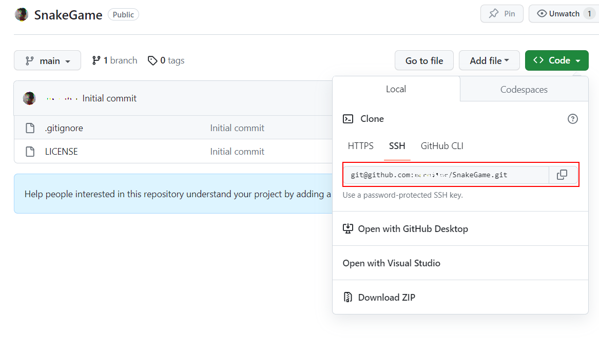

# Лабораторная работа №1: Работа с GIT

## Цель

Выполнив данную работу студент научится работать с системой контроля кода GIT.

## Задание

Создать профильный проект в GITHUB.

С целью упрощения работы предлагается выполнять шаги в среде разработки `Visual Studio Code`. Также на компьютере должен быть установлен `GIT`.

### 1. Регистрация на [GitHub](https://github.com/)

Зарегистрируйтесь на GitHub.

### 2. Создание проекта

После аутентификации на GitHub, в правом верхнем углу есть иконка `+`. Пр нажатии на неё можно создать новый репозиторий.


Создайте новый, пустой репозиторий, дайте ему название, совпадающее с логином на GITHUB.

### 3. Копирование репозитория на локальный компьютер

Создайте локальную копию репозитория, который был вами создан. Для этого скопируйте ссылку на репозиторий.



Откройте командную строку, перейдите в папку, в которой хотите держать проект, и выполните команду:

```bash
git clone <copied url>
```

Создайте новую ветку для выполнения работы.

```bash
# create a new branch and switch to
git checkout -B lab01
```

### 4. Создание структуры файлов

Добавьте в папку проекта следующие файлы:

1. `readme.md` - описание проекта
2. `images` - папка для хранения изображений

### 5. Добавление описания проекта

В файле `readme.md` добавьте:

1. Приветствие
2. Фотографию / аватар
3. Краткое описание себя
4. Области интересов
5. Языки программирования
   1. которые знаете
   2. которые изучаете
   3. которые хотите изучить
6. Как с вами связаться

### 6. Публикация кода на GitHub

В папке репозитория выполните следующие команды из командной строки:

```bash
# add all files to tracking
git add *
# check status
git status
# create a commit
git commit -m "structure defined"
# push commit to remote repository
git push
```

После этого вы можете добавить созданную ветку к ветке `main`.

## Представление

При представлении ответа прикрепите ссылку на репозиторий.

## Оценивание

- `1 балл` - создание аккаунта на GitHub
- `1 балл` - создание репозитория, совпадающего, по названию, с именем пользователя
- `1 балл` - создание описания проекта в файле `README.md`
- `1 балл` - использование параграфов `markdown`
- `1 балл` - использование заголовков `markdown`
- `1 балл` - использование списков `markdown`
- `1 балл` - использование изображений `markdown`
- `1 балл` - публикация кода на GitHub в ветку `lab01`
- `2 балла` - защита работы
- `-1 балл` - за каждый день просрочки сдачи
- `-5 баллов` - за копирование кода у других студентов
